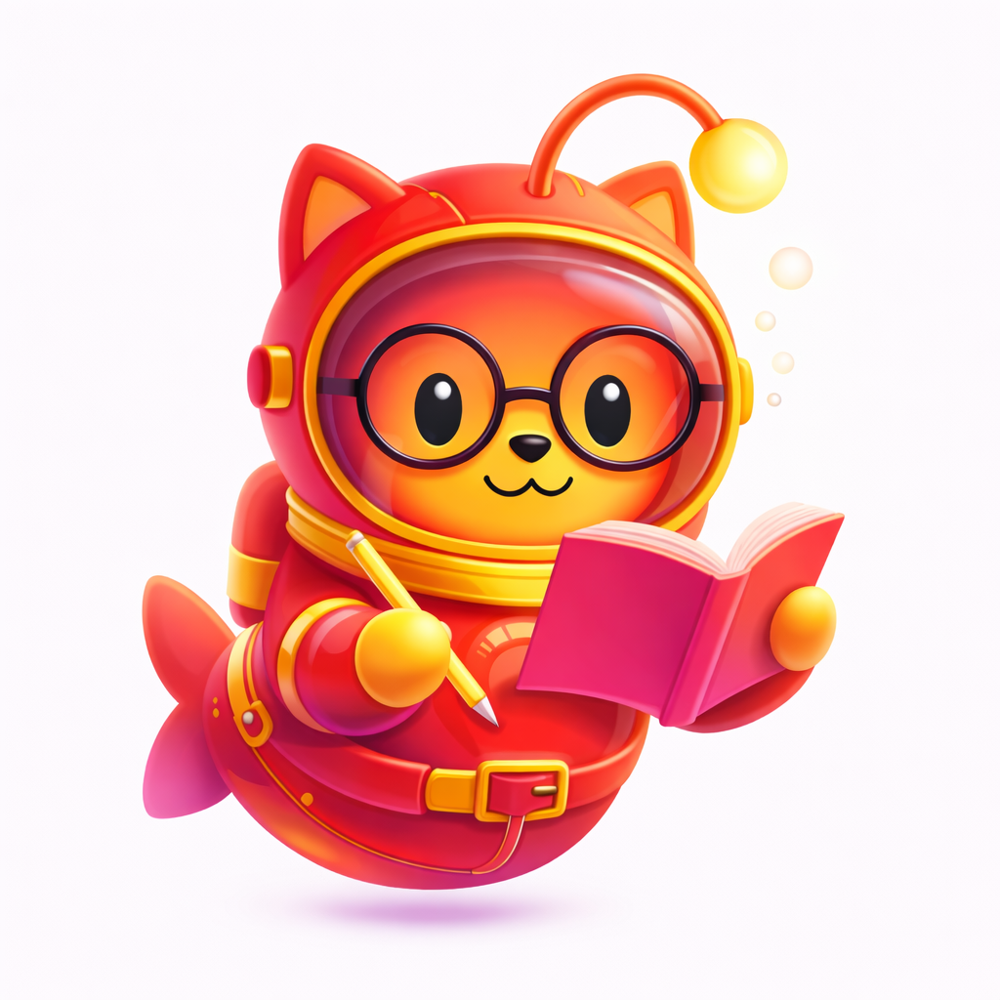

# Dogumentation

**Tertier the Doguhorse, your modern dogumentation friend.**

CLI-first. Language-agnostic. No-nonsense docs.

---

## What is this?

This org builds a documentation toolchain that you run from the CLI and get usable docs out the other side. No config rabbit holes. No academic nonsense. Just output.

The long-term goal is simple:
**Any repo → one command → clean, readable documentation.**

---

## Philosophy

- Docs should be **generated, not handcrafted**
- Output should be **structured, predictable, diff-friendly**
- Tools should work **with your repo**, not force you into a framework
- Good docs are a **developer experience feature**, not an afterthought

---

## Main projects (soon)

- **Tertier** — the core engine + CLI
- **Language adapters** — TypeScript first, others later
- **Themes & templates** — clean, readable defaults
- **Examples** — real repos, real outputs

---

## Mascot lore (important)

Meet **Doguhorse** — also known as the **Tertier Terrier**.

Part deep-sea explorer, part obsessive bookworm, fully committed to diving into your codebase and surfacing with structured, readable Dogumentation.

Yes, the pun budget is fully allocated.

---

## Contributing

Early days. Things will move fast and break occasionally.

When contributions open up:

- Clear problem statements > feature wishlists
- Repro steps > vibes
- PRs welcome once structure stabilizes

---

## Legal

This project is independent and not affiliated with GitHub.
All trademarks belong to their respective owners.
